[](https://spacegrowmedia.com)
[](https://github.com/nishitjayne)

---

##  About Me

- I spun **[SpaceGrow Media](https://github.com/nishitjayne/spacegrowmedia)** into the digital ether — a hyper-immersive 3D agency experience (boot it on desktop for max visual fidelity)
- I build **AI-powered pipelines** using Gemini, LangChain, and multi-agent systems
- Currently experimenting with **React Native**, **computer vision**, and **agentic workflows**
- Focus: shipping real products, not just side projects

---

##  Tech Stack

**Languages**


**Frameworks & Libraries**


**AI & Agents**


**Data & Infrastructure**


**Shipping**


---

##  Every Repository

**Products & clients**

```ansi
$ ls -la ~/products

  drwxr-xr-x  spacegrowmedia          HTML · CSS · Vite
  drwxr-xr-x  velmessa                React · Framer Motion
  -rwx------  mezvo-scan              [encrypted]
  -rwx------  canadian-realty         [encrypted]
```

→ [spacegrowmedia](https://github.com/nishitjayne/spacegrowmedia) · [velmessa](https://github.com/nishitjayne/velmessa) · mezvo-scan (private) · canadian-realty (private)

**AI & agents**

```ansi
$ ls -la ~/ai-agents

  drwxr-xr-x  ai-lead-qualifier       Python · Gemini · SMTP
  drwxr-xr-x  readyai                 React Native · Expo · TS
```

→ [ai-lead-qualifier](https://github.com/nishitjayne/ai-lead-qualifier) · [readyai](https://github.com/nishitjayne/readyai)

**Systems & backend**

```ansi
$ ls -la ~/systems

  drwxr-xr-x  knowledge-bounty        MERN
  drwxr-xr-x  lendenclub-identitymicro-service Node.js · JWT
```

→ [knowledge-bounty](https://github.com/nishitjayne/knowledge-bounty) · [lendenclub-identitymicro-service](https://github.com/nishitjayne/lendenclub-identitymicro-service)

**Computer vision & experiments**

```ansi
$ ls -la ~/experiments

  drwxr-xr-x  attendance-system       Python · OpenCV · Flask
  drwxr-xr-x  miniproject             HTML · JS
  drwxr-xr-x  nishitjayne             Markdown · Actions
```

→ [attendance-system](https://github.com/nishitjayne/attendance-system) · [miniproject](https://github.com/nishitjayne/miniproject) · [nishitjayne](https://github.com/nishitjayne/nishitjayne)

<sub>`-rwx------` marks a private repo. Happy to walk through either one on a call.</sub>

---

##  Boot Log


---

##  Currently Cooking

```ansi
Working on     ->  AI agents
Learning       ->  Local models with Ollama · LangGraph · vector DBs · on-device ML (Core ML)
Breaking       ->  My own products before users can
2026 goal      ->  Build 3 products that bring a unique, efficient point of view to everyday tasks
Ask me about   ->  Space · Astrophysics · Conspiracy Theories · Philosophy
```

---

```ansi
$ echo "Build fast. Ship real. Iterate always."
Build fast. Ship real. Iterate always.
```
